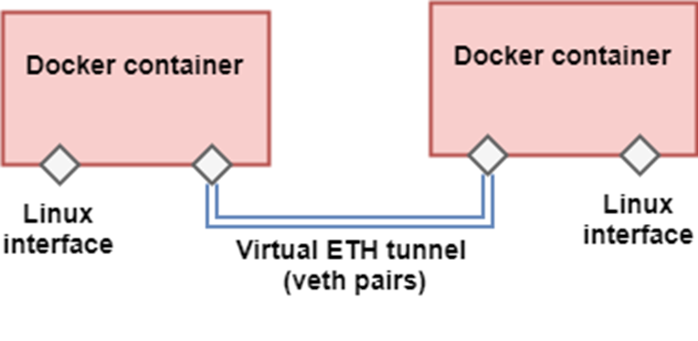

# Wireless Transport Emulator for ONF PoC 5

OpenYuma Wireless Transport Emulator (WTE) is a wireless transport topology emulation with [OpenYuma](https://github.com/OpenClovis/OpenYuma) NETCONF server,
based on [ONF TR-532](https://www.opennetworking.org/images/stories/downloads/sdn-resources/technical-reports/TR-532-Microwave-Information-Model-V1.pdf).

### Description

WTE takes as input three files:
 * a JSON topology file, with a specific structure, describing the network
to be emulated.
 * a JSON configuration file giving details about the SDN controller information,
 ranges for the NEs management IP addresses and for the hosts connected to the NEs
 * the XML configuration file based on the YANG models
to be used by each emulated Network Element as a startup configuration and
an XML file containing the status parameters of the model. These two files can
be automatically generated using a custom version of the [pyang](https://github.com/mbj4668/pyang) utility,
that is available [here](https://github.com/Melacon/pyang-we).

Each NE is emulated as a docker container and exposes a NETCONF server based on the OpenYuma
framework, reflecting an information model based on TR-532 from ONF. Links between different NEs, as
described in the JSON topology file, are emulated as connections through veth pairs. The
high-level architecture of the emulator is shown below.

As extension of Wireless Transport Emulator the java based netconf simulator [NetconfServerSimulator](NetconfServerSimulator/README.md) can be used.



### Prerequisites

These instructions are for Ubuntu.

#### Docker

Install Docker following the instructions from [here](https://store.docker.com/editions/community/docker-ce-server-ubuntu/plans/docker-ce-server-ubuntu-tier?tab=instructions).

Make sure that you follow the instructions also for **Manage Docker as a non-root user** from [here](https://docs.docker.com/engine/installation/linux/linux-postinstall/).

Summary:

```commandline
sudo apt-get -y install \
  apt-transport-https \
  ca-certificates \
  curl \
  software-properties-common
```

```commandline
curl -fsSL https://download.docker.com/linux/ubuntu/gpg | sudo apt-key add -
```

```commandline
sudo add-apt-repository \
       "deb [arch=amd64] https://download.docker.com/linux/ubuntu \
       $(lsb_release -cs) \
       stable"
```

```commandline
sudo apt-get update
```

```commandline
sudo apt-get -y install docker-ce
```

Test that the docker installation was successful:

```commandline
sudo docker run hello-world
```

Run docker without sudo:

```commandline
sudo groupadd docker
```

```commandline
sudo usermod -aG docker $USER
```

Log out and log back in so that your group membership is re-evaluated.

```commandline
docker run hello-world
```

#### Python 3.6

Install version 3.6 for python:

```
sudo add-apt-repository ppa:jonathonf/python-3.6; \
sudo apt-get update; \
sudo apt-get install python3.6; \
sudo apt-get install python3.6-dev

```

### Install

####These steps need to be done after every git pull to reflect the new changes

Build the docker container located in the OpenYuma folder:

```buildoutcfg
cd OpenYuma
./docker_build.sh
```


From the base directory run the following commands:

```
./build.sh
```

### Usage

An example of a JSON topology configuration file `topology.json` with 3 simulated devices
looks like this:

```JSON
{
  "network-elements" : [
    {
      "network-element" :
      {
        "uuid" : "NE1",
        "type" : "OpenYuma",
        "interfaces" : [
          {
            "layer" : "MWPS",
            "LTPs" : [
                      { "id": "ai1",
                        "supportedAlarms" : "signalIsLost, rslIsExceeded, signalIDMismatching, temperatureIsExceeded, modemIsFaulty, radioIsFaulty, modulationIsDownShifted",
                        "physical-port-reference" : "shelf1:slot2:card-type:port1",
                        "conditional-package" : "mw-air-interface-pac"
                      },
			          { "id": "ai2",
                        "supportedAlarms" : "signalIsLost, rslIsExceeded, signalIDMismatching, temperatureIsExceeded, modemIsFaulty, radioIsFaulty, modulationIsDownShifted",
                        "physical-port-reference" : "shelf1:slot3:card-type:port1",
                        "conditional-package" : "mw-air-interface-pac"
                      }
                    ]
          },
          {
            "layer" : "MWS",
            "LTPs" : [
                      { "id" : "pe1",
                        "supportedAlarms" : "structureAlarm",
                        "serverLTPs" : [{"id" : "ai1"}],
                        "conditional-package" : "mw-pure-ethernet-structure-pac"
                      },
			          { "id" : "pe2",
                        "supportedAlarms" : "structureAlarm",
                        "serverLTPs" : [{"id" : "ai2"}],
                        "conditional-package" : "mw-pure-ethernet-structure-pac"
                      }
                    ]
          },
          {
            "layer" : "ETC",
            "LTPs" : [
                      { "id" : "me1",
                        "supportedAlarms" : "framingIsFaulty, containerIsDown",
                        "serverLTPs" : [{"id" : "pe1"}],
                        "conditional-package" : "mw-ethernet-container-pac"
                      },
                      { "id" : "me2",
                        "supportedAlarms" : "framingIsFaulty, containerIsDown",
                        "serverLTPs" : [{"id" : "pe2"}],
                        "conditional-package" : "mw-ethernet-container-pac"
                      }
                    ]
          },
          {
            "layer" : "ETY",
            "LTPs" : [
                      {"id" : "ety1", "physical-port-reference" : "shelf1:slot1:card-type:port1"},
                      {"id" : "ety2", "physical-port-reference" : "shelf1:slot1:card-type:port2"}
                    ]
          },
          {
            "layer" : "ETH",
            "LTPs" : [
                    ]
          }
          ],
        "eth-cross-connections" : [
          
          ]
      }
    },
    {
      "network-element" :
      {
        "uuid" : "NE2",
        "type" : "OpenYuma",
        "interfaces" : [
          {
            "layer" : "MWPS",
            "LTPs" : [
                      { "id": "ai1",
                        "supportedAlarms" : "signalIsLost, rslIsExceeded, signalIDMismatching, temperatureIsExceeded, modemIsFaulty, radioIsFaulty, modulationIsDownShifted",
                        "physical-port-reference" : "shelf1:slot2:card-type:port1",
                        "conditional-package" : "mw-air-interface-pac"
                      },
			          { "id": "ai2",
                        "supportedAlarms" : "signalIsLost, rslIsExceeded, signalIDMismatching, temperatureIsExceeded, modemIsFaulty, radioIsFaulty, modulationIsDownShifted",
                        "physical-port-reference" : "shelf1:slot3:card-type:port1",
                        "conditional-package" : "mw-air-interface-pac"
                      }
                    ]
          },
          {
            "layer" : "MWS",
            "LTPs" : [
                      { "id" : "pe1",
                        "supportedAlarms" : "structureAlarm",
                        "serverLTPs" : [{"id" : "ai1"}],
                        "conditional-package" : "mw-pure-ethernet-structure-pac"
                      },
			          { "id" : "pe2",
                        "supportedAlarms" : "structureAlarm",
                        "serverLTPs" : [{"id" : "ai2"}],
                        "conditional-package" : "mw-pure-ethernet-structure-pac"
                      }
                    ]
          },
          {
            "layer" : "ETC",
            "LTPs" : [
                      { "id" : "me1",
                        "supportedAlarms" : "framingIsFaulty, containerIsDown",
                        "serverLTPs" : [{"id" : "pe1"}],
                        "conditional-package" : "mw-ethernet-container-pac"
                      },
                      { "id" : "me2",
                        "supportedAlarms" : "framingIsFaulty, containerIsDown",
                        "serverLTPs" : [{"id" : "pe2"}],
                        "conditional-package" : "mw-ethernet-container-pac"
                      }
                    ]
          },
          {
            "layer" : "ETY",
            "LTPs" : [
                      {"id" : "ety1", "physical-port-reference" : "shelf1:slot1:card-type:port1"},
                      {"id" : "ety2", "physical-port-reference" : "shelf1:slot1:card-type:port2"}
                    ]
          },
          {
            "layer" : "ETH",
            "LTPs" : [
                    ]
          }
          ],
        "eth-cross-connections" : [
          
          ]
      }
    },
    {
      "network-element" :
      {
        "uuid" : "NE3",
        "type" : "OpenYuma",
        "interfaces" : [
          {
            "layer" : "MWPS",
            "LTPs" : [
                      { "id": "ai1",
                        "supportedAlarms" : "signalIsLost, rslIsExceeded, signalIDMismatching, temperatureIsExceeded, modemIsFaulty, radioIsFaulty, modulationIsDownShifted",
                        "physical-port-reference" : "shelf1:slot2:card-type:port1",
                        "conditional-package" : "mw-air-interface-pac"
                      },
			          { "id": "ai2",
                        "supportedAlarms" : "signalIsLost, rslIsExceeded, signalIDMismatching, temperatureIsExceeded, modemIsFaulty, radioIsFaulty, modulationIsDownShifted",
                        "physical-port-reference" : "shelf1:slot3:card-type:port1",
                        "conditional-package" : "mw-air-interface-pac"
                      }
                    ]
          },
          {
            "layer" : "MWS",
            "LTPs" : [
                      { "id" : "pe1",
                        "supportedAlarms" : "structureAlarm",
                        "serverLTPs" : [{"id" : "ai1"}],
                        "conditional-package" : "mw-pure-ethernet-structure-pac"
                      },
			          { "id" : "pe2",
                        "supportedAlarms" : "structureAlarm",
                        "serverLTPs" : [{"id" : "ai2"}],
                        "conditional-package" : "mw-pure-ethernet-structure-pac"
                      }
                    ]
          },
          {
            "layer" : "ETC",
            "LTPs" : [
                      { "id" : "me1",
                        "supportedAlarms" : "framingIsFaulty, containerIsDown",
                        "serverLTPs" : [{"id" : "pe1"}],
                        "conditional-package" : "mw-ethernet-container-pac"
                      },
                      { "id" : "me2",
                        "supportedAlarms" : "framingIsFaulty, containerIsDown",
                        "serverLTPs" : [{"id" : "pe2"}],
                        "conditional-package" : "mw-ethernet-container-pac"
                      }
                    ]
          },
          {
            "layer" : "ETY",
            "LTPs" : [
                      {"id" : "ety1", "physical-port-reference" : "shelf1:slot1:card-type:port1"},
                      {"id" : "ety2", "physical-port-reference" : "shelf1:slot1:card-type:port2"}
                    ]
          },
          {
            "layer" : "ETH",
            "LTPs" : [
                    ]
          }
          ],
        "eth-cross-connections" : [
          
          ]
      }
    }
    ],
  "topologies" : {
    "mwps" : {
      "links" : [
        [{"uuid" : "NE1", "ltp" : "ai2", "radio-signal-id" : "26"}, {"uuid" : "NE2", "ltp" : "ai1", "radio-signal-id" : "26"}],
        [{"uuid" : "NE2", "ltp" : "ai2", "radio-signal-id" : "27"}, {"uuid" : "NE3", "ltp" : "ai1", "radio-signal-id" : "27"}],
        [{"uuid" : "NE3", "ltp" : "ai2", "radio-signal-id" : "28"}, {"uuid" : "NE1", "ltp" : "ai1", "radio-signal-id" : "28"}]
        ]
    },
    "ety" : {
      "links" : [        
      ]
    }
  }
}

```

An example emulator configuration file `config.json` is shown below:

```JSON
{
  "controller" : [  
  {
    "ip-address" : "192.168.254.254",
    "port" : 8181,
    "username" : "admin",
    "password" : "admin"
  }
  ],
  "managementIpNetwork" : "192.168.0.0/16",
  "hostIpNetwork" : "10.10.0.0/16",
  "notificationPeriod" : 10,
  "automatic-odl-registration" : true,
  "portBasedEmulation" : true,
  "netconfPortBase" : 12000,
  "sshPortBase" : 15000,
  "emulatorIpAddress" : "192.168.254.253"
}
```

The information about the SDN controller, where the emulated NEs automatically
register, is available under the `controller` object.

The range for the management IP of the network elements is given by the
`managementIpNetwork` object, and the range for the IPs of the hosts connected to the NEs
is configurable through the `linksIpNetwork` element.

Each  NE is capable of generating a random `problem-notification` NETCONF nofiticaion,
from its available `supported-alarms`. The value of `notificationPeriod` object
represents the amount of **seconds** between each such  random notifications.

* Starting the emulator is done with the following command (asuming you are in the base folder):

`sudo wtemulatorpoc5 --config=config.json --topo=topology.json --xml=yang/microwave-model-config.xml`

Alternatively, the emulator can be starting using the `start.sh` script, after you configure there what topology file to be used:

`./start.sh`

* Stopping the emulator is done with the commands `quit` or `exit` executed from the CLI. This will delete
all the previously created docker containers, docker networks.

* Cleaning might be necessary if previous runs were not terminated correctly. This will delete
all the previously created docker containers, docker networks.

`sudo wtemulatorpoc5 --config=config.json --clean`

Alternatively:

`./clean.sh`

### Contact

alex.stancu@radio.pub.ro

alexandrus@ceragon.com
